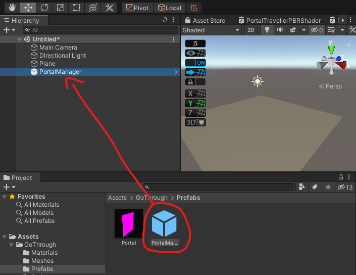
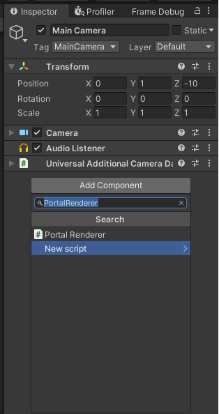
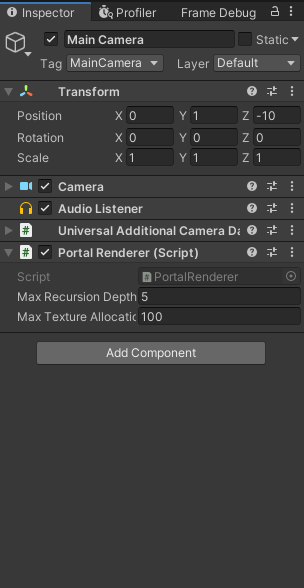
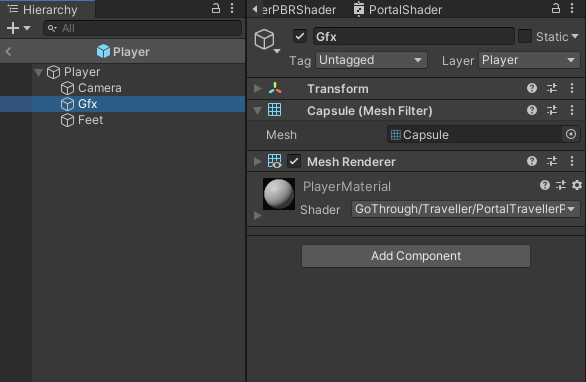
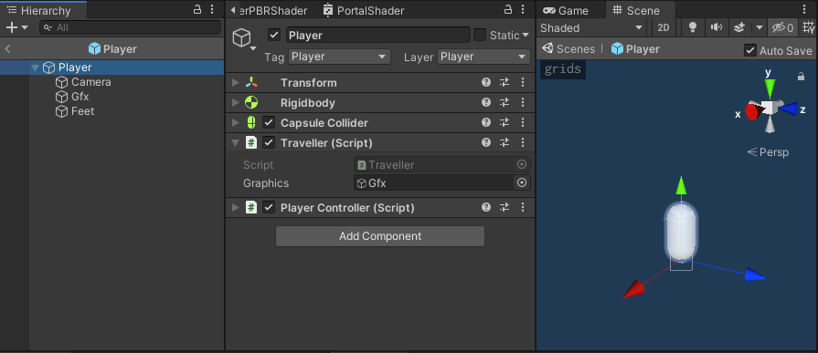
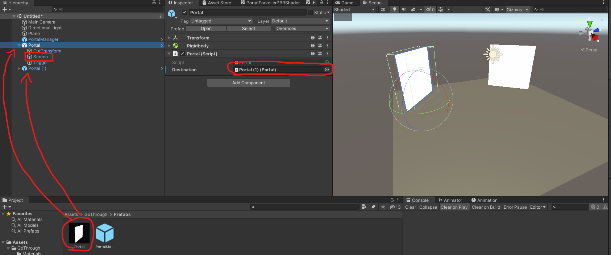

# GoThrough

GoThrough is an Unity plugin made for the Universal Render Pipeline that enables it's users to easily add transformative portals to their scenes. Usage of the [latest release](https://github.com/lams3/GoThrough/releases/tag/v1.0.0) is described bellow.

##  Setup the PortalManager

The first step to have GoThrough Portals working in your scene, is to place an instance of the PortalManager prefab on it. The prefab can be found at the GoThrough/Prefabs folder.

## Setup a PortalRenderer

To properly render Portals, a camera must have an PortalRenderer component attached to it. This component is responsible for managing all the resources needed to correctly render Portals. Recursion depth and the maximum number of textures allocated can be changed through the inspector.

## Setup Travellers

In order to travel through Portals, GameObjects need to be properly configured as Travellers. The Player prefab in GoThroughSamples/Common will be used as an example. 

First, any graphical part (meshes) of the GameObject should be moved to a separate child object. The materials in those meshes should also use one of the shaders in the GoThrough/Shaders/Traveller folder.

Then a Traveller component must be added to the GameObject with a reference to it's graphics child previously created.

GoThrough's Traveller Component doesn't currently support rigged meshes as part of the graphics GameObject.

## Setup Portals

Portals can be placed using the Portal prefab in GoThrough/Prefabs. After placing a Portal in the scene, it's destination should be referenced through the inspector. A Portal's size can be adjusted by scaling it's screen GameObject.

